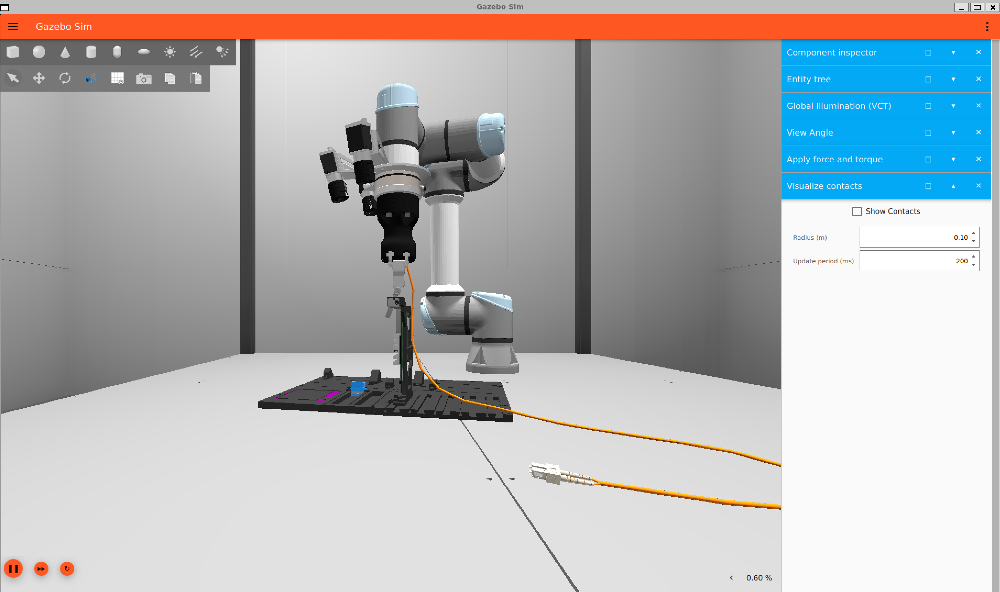

# EECS 590 Reinforcement Learning - Capstone Project V2

[](https://opensource.org/licenses/MIT)
[](https://www.python.org/downloads/)

**Author:** Ashutosh Kumar  
**Course:** EECS 590 - Reinforcement Learning, Spring 2026  
**Version:** V2  
**Due Date:** February 27, 2026

---

## V2 Requirements Compliance

| # | Requirement | Status | Location |
|---|-------------|--------|----------|
| 1 | GitHub Repository Formatting (Cookiecutter) | ✅ | Project structure |
| 2 | Documentation/Organization | ✅ | This README, `requirements.txt` |
| 3 | MDP Representation (rewards/states/beliefs) | ✅ | `rl_capstone/mdp/` |
| 4 | Dynamic Programming Implementation | ✅ | `rl_capstone/algorithms/` |
| 5 | Agent Framework (train/evaluate) | ✅ | `rl_capstone/agents/` |
| 6 | New DRL Algorithm — **PPO** | ✅ | `rl_capstone/aic_competition/training/ppo_residual.py` |
| 7 | NN Architecture + Checkpoints | ✅ | `rl_capstone/aic_competition/perception/`, `models/checkpoints/` |
| 8 | Difficulties and Surprises | ✅ | `docs/docs/technical-challenges.md` |
| 9 | Justification for Algorithm Choice | ✅ | Below in this README |

**Documentation:** [docs/docs/index.md](docs/docs/index.md) | **AIC Competition Code:** [rl_capstone/aic_competition/](rl_capstone/aic_competition/)

---

## Project Overview

This capstone project applies **Reinforcement Learning to robotic cable insertion** for the [Intrinsic AI for Industry Challenge](https://discourse.openrobotics.org/t/ai-for-industry-challenge-challenge-details/52380). A UR5e robot arm must insert SFP and SC cables into server rack ports using only camera images and force/torque feedback — no ground truth pose information at evaluation time.

### Foundation Environment: Windy Chasm (Mini 2)

A discrete MDP where a drone navigates through a windy chasm:
- **State Space S**: Grid (i,j) ∈ [0,19]×[0,6] + terminal states {crash, goal}
- **Action Space A**: {Forward, Left, Right}
- **Transition P(s'|s,a)**: Deterministic action + stochastic wind p(j) = B^(1/(1+(j-3)²))
- **Reward R**: step=-1, goal=+20, crash=-5
- **Discount γ**: 0.99

### Capstone Environment: UR5e Cable Insertion (AI for Industry Challenge)

- **Robot**: Universal Robots UR5e (6-DOF arm)
- **Gripper**: Robotiq Hand-E (parallel jaw)
- **Sensor**: ATI Axia80 Force-Torque sensor
- **Vision**: Three wrist-mounted Basler cameras
- **Task**: Insert SFP and SC cables into server rack ports
- **Simulator**: Gazebo (ROS 2)
- **Challenge**: [AI for Industry Challenge](https://discourse.openrobotics.org/t/ai-for-industry-challenge-challenge-details/52380)

---

## What's New in V2

### PPO + Residual Policy for Cable Insertion

The main addition in V2 is a full deep RL pipeline for the AIC competition. The approach is based on the ResiP (Residual for Precise Manipulation) framework:

1. **DAgger (Dataset Aggregation)** collects expert demonstrations using ground truth TF data during training, building a behavior cloning baseline
2. **PPO (Proximal Policy Optimization)** trains a residual correction on top of the DAgger baseline, learning to handle situations the expert didn't cover well
3. At deployment, PPO is the primary policy. When PPO's entropy is high (it's uncertain), the system falls back to the DAgger policy as a safety net
4. The policy outputs not just pose corrections but also **impedance parameters** (stiffness K, damping D, feedforward force F) — so the robot adapts how compliant it is based on the contact situation

### Perception CNN (Port2DNetV4)

Since ground truth TF is not available during competition evaluation, I trained a CNN to detect port locations from camera images:

- ResNet-18 backbone with Feature Pyramid Network (FPN) for multi-scale features
- Spatial softmax output for subpixel keypoint localization
- FiLM conditioning on connector type (SFP vs SC) so one model handles both
- Trained on 194 episodes of diverse training data collected in Gazebo
- 3-camera triangulation for 3D port position from 2D detections

### Gaussian HMM Phase Estimator

The robot needs to know what phase of insertion it's in (free space, near contact, alignment, insertion, seated). I initially used hard-coded force thresholds but that was too brittle — the robot would think it was done at 10mm depth. I replaced it with:

- A Hidden Markov Model with 5 states (one per contact phase)
- Gaussian emission models fitted from 154 training episodes
- Bayesian belief updates at each timestep
- A depth gate that prevents declaring "seated" until the connector is deep enough
- Temporal consistency filter requiring 5 consecutive steps of high SEATED belief

### Training Data

Training data was collected in Gazebo with ground truth enabled:
- **PPO episodes**: 154 episodes across multiple iterations (SFP + SC connectors)
- **Perception data**: 194 episodes of camera images with ground truth port labels
- **DAgger rounds**: 3 rounds of interactive correction data

Sample training images showing insertion phases are in [`rl_capstone/aic_competition/images/`](rl_capstone/aic_competition/images/).

### Gazebo Simulation & RViz Visualization




For full environment details and competition status, see:
- [Environment & Hardware](rl_capstone/aic_competition/docs/environment.md)
- [Competition Progress & Status](rl_capstone/aic_competition/docs/status.md)

---

## Justification: Why PPO for Cable Insertion

I chose **PPO** as my deep RL algorithm. Here's why, compared to the alternatives:

### Why PPO Works Here

- **Contact-rich manipulation has continuous actions**: The robot outputs 6D pose corrections + 18D impedance parameters = 24D continuous action space. PPO handles continuous actions naturally with its Gaussian policy.
- **On-policy stability matters**: Insertion is sensitive to small errors. Off-policy methods like SAC/TD3 can be more sample efficient but their replay buffers mix data from different policies, which causes instability when the dynamics change a lot between "in contact" and "free space."
- **Clipping prevents catastrophic updates**: PPO's clipped objective keeps policy updates small. This is critical because a large bad update could make the robot jam the connector and damage it.
- **Works well with residual learning**: The ResiP framework (Johannink et al., 2019; Li et al., 2024) adds RL corrections on top of a base policy. PPO's conservative updates are ideal here because the residual should stay small.

### Why Not the Others

| Algorithm | Why Not for This Task |
|-----------|----------------------|
| **DQN** | Discrete actions only. Can't output continuous 24D pose+impedance corrections. Would need massive discretization. |
| **REINFORCE** | High variance without a baseline. With 24D actions and sparse contact rewards, it would need far too many episodes to converge. |
| **Vanilla Actor-Critic** | No trust region — updates can be too large and destabilize the insertion. PPO adds the clipping that makes it safe. |
| **DDPG** | Deterministic policy can't explore well in the multi-modal contact landscape. Also off-policy replay buffer issues mentioned above. |
| **TD3** | Same off-policy issues as DDPG. The twin critics help with value overestimation but don't fix the fundamental replay instability in contact tasks. |
| **TRPO** | Theoretically similar guarantees to PPO but much harder to implement correctly (conjugate gradient, Fisher vector products). PPO achieves similar results with simpler code. |
| **SAC** | Maximum entropy objective encourages exploration, which is good. But for precise insertion you want the policy to converge to a narrow, confident behavior — not maintain entropy. Also off-policy. |

### The Bottom Line

PPO gives the best tradeoff of stability, continuous action support, and compatibility with residual learning for this contact-rich manipulation task. The DAgger fallback covers the exploration weakness (PPO doesn't need to explore from scratch — it starts from a decent base policy).

---

## Project Organization

```
├── README.md
├── requirements.txt
├── pyproject.toml
│
├── models/
│   ├── policy_kernel/              <- V1: Windy Chasm trained policies
│   └── checkpoints/                <- V2: AIC competition model weights
│       ├── perception/port_2d_v4.pt    <- CNN port detector (45MB, ResNet-18+FPN)
│       ├── ppo/                        <- PPO actor, critic, residual MLP
│       ├── dagger/residual_mlp.pt      <- DAgger expert baseline
│       └── hmm/phase_hmm_params.npz   <- Fitted HMM parameters
│
├── notebooks/
│   ├── 01_mini1_mrp_analysis.ipynb
│   ├── 02_mini2_mdp_analysis.ipynb
│   ├── 03_mini3_dqn_atari_breakout.ipynb
│   └── 03_mini3_policy_gradient.ipynb
│
├── reports/figures/                 <- V1 figures
│
├── docs/docs/
│   └── technical-challenges.md     <- V2: bugs, surprises, lessons
│
├── rl_capstone/
│   ├── mdp/                        <- V1: MDP framework
│   ├── algorithms/                 <- V1: Value iteration, policy iteration, TD(λ)
│   ├── agents/                     <- V1: Agent train/evaluate framework
│   ├── environments/               <- Windy Chasm + UR5e env interface
│   │
│   └── aic_competition/            <- V2: Full AIC competition codebase
│       ├── policy/
│       │   └── SmartInsert.py          <- Main insertion policy (2800+ lines)
│       ├── perception/
│       │   ├── train_port_2d_v4.py     <- CNN training script
│       │   └── train_port_2d_detector.py
│       ├── training/
│       │   ├── ppo_residual.py         <- PPO actor-critic + hybrid policy
│       │   ├── train_ppo_gazebo.py     <- PPO training loop in Gazebo
│       │   ├── residual_mlp.py         <- Shared MLP architecture
│       │   ├── dagger_loop.py          <- DAgger data collection
│       │   ├── relabel_rewards.py      <- Reward relabeling for old data
│       │   └── train_yd_rrl.py         <- Residual RL training
│       ├── phase_estimation/
│       │   ├── fit_phase_hmm.py        <- Fit Gaussian HMM from episodes
│       │   └── phase_belief.py         <- Bayesian phase belief tracker
│       ├── docs/
│       │   ├── environment.md          <- Hardware, simulator, observation/action space
│       │   └── status.md              <- Competition progress, scores, known issues
│       └── images/                     <- Training episode camera snapshots
│           ├── ep0_sfp_*_center.png
│           └── ep2_sc_*_center.png
│
└── scenes/                         <- Isaac Sim USD scenes (V1)
```

---

## How the System Works

```
Camera Images ──► Port2DNetV4 (CNN) ──► 3D Port Position
                                              │
Force/Torque ──► PhaseGaussianHMM ──► Contact Phase (0-4)
                                              │
Robot State + Port + Phase ──► PPO Actor ──► Δpose + ΔK + ΔD + ΔF
                                    │                │
                              (high entropy?)   Impedance Controller
                                    │                │
                               DAgger Expert    Robot Executes
                               (fallback)
```

1. **Perception**: CNN predicts port location from 3 camera views, triangulates to 3D
2. **Phase estimation**: HMM tracks which insertion phase we're in using force readings
3. **Policy**: PPO residual outputs corrections + impedance parameters
4. **Fallback**: If PPO is uncertain (high entropy), switch to DAgger expert
5. **Execution**: Impedance controller applies the action with adaptive compliance

---

## Results So Far

### Perception CNN
- Trained on 194 episodes, 300 epochs
- 3-camera triangulation accuracy: ~2mm at approach distance
- FiLM conditioning handles both SFP and SC with one model

### PPO Training
- 154 episodes collected across multiple iterations
- Trained with GAE (λ=0.95), clip ratio 0.2, 10 PPO epochs per batch
- DAgger warm-start for initial policy weights

### Evaluation (Work in Progress)
- SFP insertion: working with perception-only (no ground truth)
- SC insertion: deeper depth targets needed, currently being tuned
- Gaussian HMM phase estimator deployed, evaluating improvement

---

## V1 Details

### V1 Requirements Compliance

| # | Requirement | Status | Location |
|---|-------------|--------|----------|
| 1 | GitHub Repository Formatting (Cookiecutter) | ✅ | Project structure |
| 2 | Documentation/Organization | ✅ | This README, `requirements.txt` |
| 3 | MDP Representation (rewards/states/beliefs) | ✅ | `rl_capstone/mdp/` |
| 4 | Dynamic Programming Implementation | ✅ | `rl_capstone/algorithms/` |
| 5 | Agent Framework (train/evaluate) | ✅ | `rl_capstone/agents/` |

### Requirement 3: MDP Representation

#### Belief MDP (Model-Based RL Foundation)

The `BeliefMDP` class allows agents to maintain and update beliefs about transition dynamics and rewards — essential for model-based RL:

```python
from rl_capstone.mdp import BeliefMDP

# Create MDP with learnable beliefs
belief_mdp = BeliefMDP(n_states=142, n_actions=3, gamma=0.99)

# Agent observes transition and updates beliefs
belief_mdp.update_beliefs(state=42, action=0, reward=-1.0, next_state=63)

# Query current beliefs
P_believed = belief_mdp.get_believed_transition(state=42, action=0)
R_believed = belief_mdp.get_believed_reward(state=42, action=0)
```

### Requirement 4: Dynamic Programming

#### Implemented Algorithms

| Algorithm | Values V | Q-Values Q | Code |
|-----------|----------|------------|------|
| Value Iteration | ✅ | ✅ | `value_iteration.py`, `q_value_iteration.py` |
| Policy Iteration | ✅ | ✅ | `policy_iteration.py` |
| Policy Improvement | ✅ | ✅ | Greedy extraction |
| TD(λ) | ✅ | - | `td_lambda.py` |

#### Key Equations

**Value Iteration (V):**
```
V_{k+1}(s) = max_a [R(s,a) + γ Σ P(s'|s,a) V_k(s')]
```

**Q-Value Iteration:**
```
Q_{k+1}(s,a) = R(s,a) + γ Σ P(s'|s,a) max_{a'} Q_k(s',a')
```

**Policy Improvement:**
```
π'(s) = argmax_a Q(s,a)
```

**TD(λ) Update:**
```
V(s) ← V(s) + α [G_t^λ - V(s)]
where G_t^λ = (1-λ) Σ λ^(n-1) G_t^(n)
```

### Requirement 5: Agent Framework

#### Usage Example

```python
from rl_capstone.agents import DPAgent, Trainer
from rl_capstone.environments import WindyChasmEnv

# Create environment
env = WindyChasmEnv(B=0.5, gamma=0.99)

# Create agent
agent = DPAgent(env, method="value_iteration")

# Train
trainer = Trainer(agent, env)
results = trainer.train()
print(f"V*(start) = {results['v_start']:.4f}")

# Evaluate
eval_results = trainer.evaluate(num_episodes=100)
print(f"Success rate: {eval_results['success_rate']:.1%}")

# Save best policy + value function
trainer.save("models/policy_kernel/best_v1.pkl")

# Load and continue
trainer.load("models/policy_kernel/best_v1.pkl")
```

### V1 Results Summary

#### V*(0,3) vs Wind Parameter B

| B | V*(0,3) | Success Rate | Convergence |
|---|---------|--------------|-------------|
| 0.3 | 12.38 | 95% | 847 iters |
| 0.5 | 7.82 | 78% | 923 iters |
| 0.7 | 3.21 | 52% | 1034 iters |

#### Policy Behavior
- **Lower B** (weak wind): Aggressive forward-moving policy
- **Higher B** (strong wind): Conservative centering policy

### What I Built in V1

#### Core RL Framework
1. ✅ **Cookiecutter project structure** following data science best practices
2. ✅ **MDP Framework** with belief updating for model-based RL
3. ✅ **Value Iteration** on both V and Q values
4. ✅ **Policy Iteration** with policy evaluation and improvement
5. ✅ **TD(λ)** as alternative to DP methods
6. ✅ **Agent Framework** with train/evaluate/save capabilities
7. ✅ **Trained Agent** saved at `models/policy_kernel/windy_chasm_B0.3.pkl`

#### Isaac Sim Integration
8. ✅ **Windy Chasm Visualization** - Interactive 3D scene with UI controls
9. ✅ **UR5e Cable Insertion Scene** - Preliminary setup for AI for Industry Challenge
10. ✅ **USD Scene Files** - Reusable scenes in `scenes/` folder
11. ✅ **Scene Loading Scripts** - `load_ur5e_scene.py` for testing

#### AI for Industry Challenge Preparation
12. ✅ **UR5e Environment** - Gymnasium-style interface in `ur5e_cable_insertion.py`
13. ✅ **Hardware Configs** - Robot, gripper, sensor specifications as dataclasses
14. ✅ **Isaac Sim Assets** - Correct CDN paths for UR5e model

### Hardware Stack

| Component | Model | Specifications |
|-----------|-------|----------------|
| **Robot Arm** | Universal Robots UR5e | 6-DOF, 5kg payload, ±0.03mm repeatability |
| **Gripper** | Robotiq Hand-E | Parallel jaw, 50mm stroke, 130N grip force |
| **F/T Sensor** | ATI Axia80 | 6-axis, 80mm OD, EtherCAT interface |
| **Cameras** | Basler (x3) | Wrist-mounted, stereo vision |

### Isaac Sim Scenes

Pre-built USD scenes are available in the `scenes/` folder:

| Scene | Description | File |
|-------|-------------|------|
| Windy Chasm | 3D visualization of Mini 2 MDP with wind indicators | `windy_chasm_scene.usd` |
| UR5e Cable Insertion | Preliminary setup for AI for Industry Challenge | `ur5e_cable_insertion_scene.usd` |

---

## Installation & Quick Start

### Prerequisites
- Python 3.11+
- NVIDIA Isaac Sim 4.5+ (for visualization only)
- PyTorch 2.0+ (for V2 AIC competition code)
- ROS 2 Humble + Gazebo (for competition evaluation)

### Installation

```bash
git clone https://github.com/ashuxen/eecs590_rl_capstone.git
cd eecs590_rl_capstone

python -m venv venv
source venv/bin/activate  # Linux/Mac
# venv\Scripts\activate   # Windows

pip install -r requirements.txt
pip install -e .
```

### Run Demo (Windy Chasm)

```bash
python -m rl_capstone.environments.windy_chasm --B 0.5 --gamma 0.99 --episodes 10
make demo
```

### Train and Evaluate

```bash
python -m rl_capstone.agents.trainer --method value_iteration --save models/policy_kernel/v1.pkl
python -m rl_capstone.agents.trainer --evaluate --load models/policy_kernel/v1.pkl --episodes 100
```

### Isaac Sim Visualization

```powershell
C:\isaacsim\IsaacLab\_isaac_sim\python.bat rl_capstone\visualization\windy_chasm_interactive.py
C:\isaacsim\IsaacLab\_isaac_sim\python.bat load_ur5e_scene.py
```

---

## Challenges & Risks

1. **Scalability**: Tabular methods limited to small state spaces
2. **Sim-to-Real Gap**: Physics differences between simulation and reality
3. **Cable Modeling**: Deformable objects require advanced techniques
4. **SC Connector**: Requires deeper insertion and more precise alignment than SFP

---

## Next Steps (V3)

1. [ ] Improve SC connector insertion success rate
2. [ ] Explore POMDP formalization for partial observability during insertion
3. [ ] Bayesian belief updates as generic utility
4. [ ] Multi-agent adaptation if needed
5. [ ] Integrate metaheuristic optimization for impedance parameter tuning

---

## Citations

### Algorithms & Theory
- Bellman, R. (1957). *Dynamic Programming*. Princeton University Press.
- Sutton, R. S., & Barto, A. G. (2018). *Reinforcement Learning: An Introduction* (2nd ed.). MIT Press.
- Schulman, J. et al. (2017). *Proximal Policy Optimization Algorithms*. arXiv:1707.06347.
- Ross, S. et al. (2011). *A Reduction of Imitation Learning and Structured Prediction to No-Regret Online Learning*. AISTATS. (DAgger)
- Johannink, T. et al. (2019). *Residual Reinforcement Learning for Robot Control*. ICRA.
- Li, C. et al. (2024). *ResiP: Residual Policy for Precise Manipulation*. arXiv:2407.16677v4.
- He, K. et al. (2016). *Deep Residual Learning for Image Recognition*. CVPR. (ResNet)
- Lin, T.-Y. et al. (2017). *Feature Pyramid Networks for Object Detection*. CVPR. (FPN)
- Rabiner, L. R. (1989). *A Tutorial on Hidden Markov Models*. Proc. IEEE. (HMM)

### Software & Tools
- Gazebo: https://gazebosim.org/
- ROS 2 Humble: https://docs.ros.org/en/humble/
- PyTorch: https://pytorch.org/
- NumPy: https://numpy.org/
- Gymnasium: https://gymnasium.farama.org/

### AI for Industry Challenge
- Challenge Details: https://discourse.openrobotics.org/t/ai-for-industry-challenge-challenge-details/52380
- Universal Robots UR5e: https://www.universal-robots.com/products/ur5-robot/
- Robotiq Hand-E: https://robotiq.com/products/hand-e-adaptive-robot-gripper
- ATI Axia80: https://www.ati-ia.com/products/ft/ft_models.aspx?id=Axia80

### Course Materials
- EECS 590 Lecture Slides (Dr. Alexander Lowenstein)

### LLM/AI help
- [Chatgpt] open ai chat gpt for coockiecutter setup
- [Chatgpt] open ai chat gpt for Code debugging and documentation

---

## Collaborators & Contributions

| Contributor | Role | Contributions |
|-------------|------|---------------|
| Ashutosh Kumar | Primary Author | All implementations |

*No external collaborators for V1 & V2.*

---

## License

MIT License - See [LICENSE](LICENSE) file.

---

## Contact

**Ashutosh Kumar**  
Email: ashutosh.kumar@und.edu  
GitHub: [@ashuxen](https://github.com/ashuxen)

---

*Last updated: February 2026*
